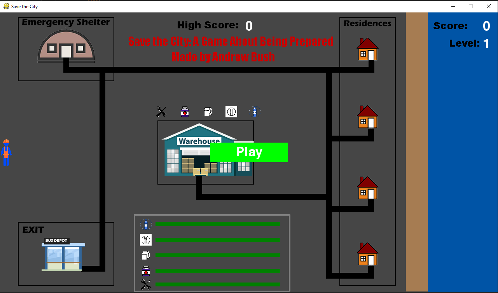

# pygame-STC

SAVE THE CITY 

A simple and fun game created to bring awareness to emergency preparation. 

## How to play:

The objective of this game is to keep the community alive for as long 
as possible by delivering resources to the residential area. The resources are obtained 
from the warehouse.
The game takes place in the aftermath of a storm, and all resources are needed for the town to survive.
Each resource is worth a number of points that increases as the game goes on.
The difficulty of the game and the rate of the depletion of resources increases as well.

If one of the resources reaches 0, you have failed but you can easily restart the game.

How to control:

Control the FEMA worker with the arrow keys.

   Other keys include:

   p = starts the game
   q = quits the game

How to succeed:

Get the highest score possible.

TIP: Balance getting resources that give the highest quantity for each collection with the ones that are closest to being depleted.

## Built With

* [Pygame] (https://www.pygame.org)

## Authors
* **Willow560**

## Acknowledgments

Matthes, Eric (2019) Python Crash Course (2nd edition) 

Used the examples in the pygame project as a template for the game's code. 
